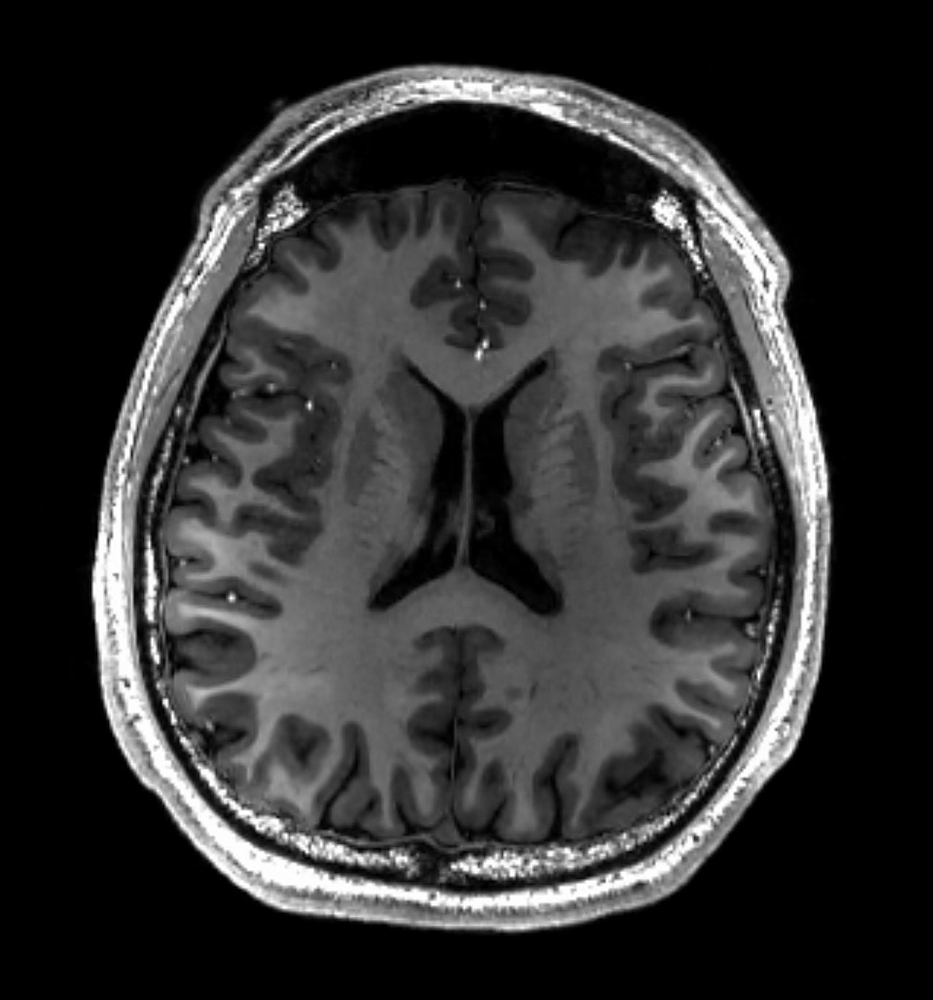
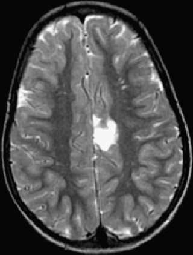

# MRI Brain Tumor Classifier

  
   

This project is a deep learning-based classifier that predicts whether a patient's MRI scan shows signs of a Brain tumor or a healthy brain. The model was trained using a convolutional neural network (CNN) to classify MRI images into one of these two categories.

## Table of Contents
- [Project Overview](#project-overview)
- [Model Architecture](#model-architecture)

## Project Overview
Brin MRI scans are an essential tool in diagnosing patient's Brain condition. This model uses a CNN to analyze Brain MRI images and predict whether the patient has:
- **Brain Tumor (yes)**, or
- **Healty Brain (no)**,

The model was trained on a labeled dataset of Brain MRIs and demonstrates good performance on the test set. 

## Model Architecture
The neural network was built using PyTorch and consists of the following layers:
- Convolutional layers to extract features from X-ray images.
- Max-pooling layers to downsample the feature maps.
- Fully connected layers to classify the extracted features into one of three classes (yes "Tumor", no"Health")

### Layers:
1. **Conv2d Layer 1**: Input channels: 3 (RGB), Output channels: 6, Kernel size: 3
2. **Conv2d Layer 2**: Input channels:6, Output channels: 16, Kernel size: 3
3. **Conv2d Layer 3**: Input channels:16, Output channels: 32, Kernel size: 3
4. **Fully connected layer 1**: 32 * 30 * 30 input neurons, 1000 output neurons
5. **Fully connected layer 2**: 1000 input neurons, 500 output neurons
6. **Fully connected layer 3**: 500 input neurons, 50 output neurons
7. **Fully connected layer 4**: 50 input neurons, 10 output neurons
8. **Fully connected layer 5**: 10 input neurons, 2 output neurons

The model was trained using cross-entropy loss and optimized using the Adam optimizer.

